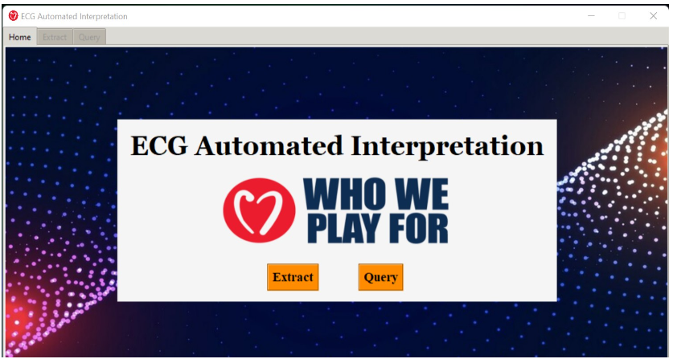
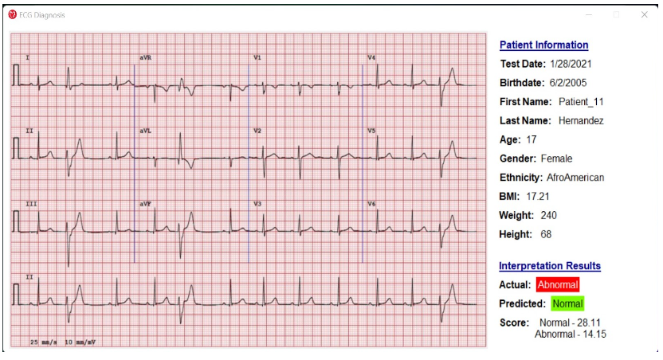

# Software Engineer/Data Science

## Skills
- **Programming Languages:** Python, MySQL, IBM Q Experience, VS Code, Eclipse, Junit, PyTorch
- **Machine/Deep Learning Libraries:** Scikit-Learn, PyTorch, Pandas, NumPy
- **Areas of Machine Learning Research:** Natural Language Processing, Explainable AI, Regression & Classification
- **IDE:** Visual Studio, IntelliJ IDEA, Eclipse
- **Alternate Technologies:** IBM Q Experience, Junit, GitHub, MySQL, ReactJS

## Education
- M.S., Computer Science | Florida Tech (_August 2023 - Present_)
- B.S., Software Engineering | Florida Tech (_May 2022_)

## Work Experience
**Graduate Student Assistant @  Florida Institute of Technology (_August 2023 - Present_)**
- Supported faculty in grading and holding office hours in the Applied Discrete Mathematics course for around 100 students.
- Fulfilled short-term instructor responsibilities by assisting with the Applied Discrete Mathematics course materials.
- Offered guidance and support to students through the Computer Science Help Desk on various computing courses.

**Graduate Research Assistant @ Florida Institute of Technology (_August 2022 - August 2023_)**
- Conducted a user study using expert-automated social media posts to identify common diagnosis patterns for suicide and depression.
- Evaluated the generated explanations against the explanations that were written by the mental health participants in the user study using Machine Learning/ Natural Language Processing metrics.
- Oversaw data collection, scraping, and mining in the ethical landscape of Artificial Intelligence integration in educational settings.

**Software Engineer/Developer @ Who We Play For (_August 2021 - May 2022_)**
- Aided in creating a Convolutional Neural Network (CNN) to interpret pediatric electrocardiograms (ECGs)
- Led the building, designing, and testing of the ECG system's Graphical User Interface (GUI).

## Projects
### Natural Language Explanations for Suicide Risk Classification Using Large Language Models
[Publication](https://ceur-ws.org/Vol-3649/Paper5.pdf)

### Conceptualizing Suicidal Behavior: Utilizing Explanations of Predicted Outcomes to Analyze Longitudinal Social Media Data
[Publication](https://arxiv.org/abs/2312.08299)

### ECG Automated Interpretation (ECGAI)

- ECGAI Home Screen that shows its features of Image Extraction and ECG Interpretation with Query. 

- ECGAI Diagnosis Results Screen that shows the patient’s information and interpretation results. 

[GUI Demo Video](https://drive.google.com/file/d/1-qP9rrQgHox8bDNeIgJ2bw7nouTjK59B/view?usp=sharing)

## Publications
1. Nur, N., S. J. Goh, J. Patel, and M. Mizrahi. "NAVIGATING THE ETHICAL LANDSCAPE OF AI INTEGRATION IN EDUCATIONAL SETTINGS." In INTED2024 Proceedings, pp. 7654-7663. IATED, 2024.
2. Stern, William, Seng Jhing Goh, Nasheen Nur, Patrick J. Aragon, and Thomas Mercer. "Natural Language Explanations for Suicide Risk Classification Using Large Language Models." (2024).
3. Nur, Nasheen, William Stern, Thomas Mercer, Chiradeep Sen, Siddhartha Bhattacharyya, Victor Tumbiolo, and Seng Jhing Goh. "Conceptualizing Suicidal Behavior: Utilizing Explanations of Predicted Outcomes to Analyze Longitudinal Social Media Data." In 2023 International Conference on Machine Learning and Applications (ICMLA), pp. 2095-2102. IEEE, 2023.

